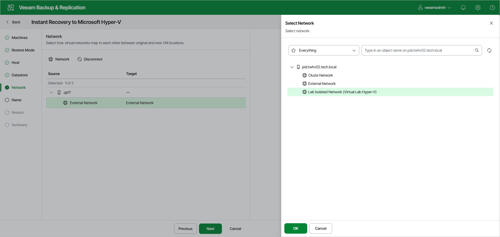

# Step 6. Configure Network Mapping

The Network step of the wizard is available if you have selected Restore to a new location or with different settings at the [Restore Mode](ir_mode_hv_web.md) step.

At the Network step of the wizard, configure a network mapping table. This table maps networks in the original site to networks in the target site (the site where workloads will be recovered). When the job starts, Veeam Backup & Replication will check the network mapping table. Then Veeam Backup & Replication will update configuration files to replace the original networks with the specified networks in the target site. As a result, you will not have to re-configure network settings manually.

To change the networks to which the restored VMs will be connected:

1. Select the necessary networks in the list and click Network.
2. From the list of available networks, choose a network to which the VM must have access upon restore.
3. Click OK to save the changes.

If you do not want to map a network to your virtual network, select the network in the list and click Disconnected.

