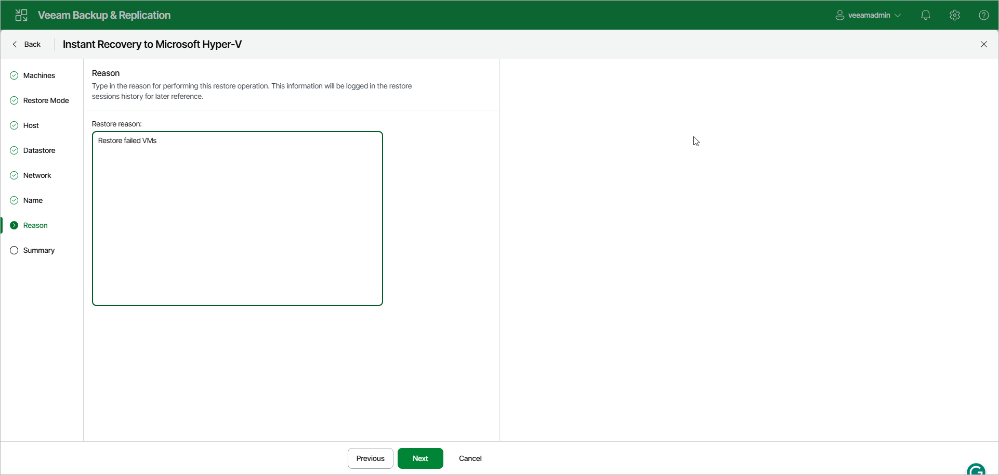

# Step 8. Specify Restore Reason

At the Reason step of the wizard, enter a reason for performing Instant Recovery of the workloads. The information you provide will be saved in the session history and you can reference it later.

