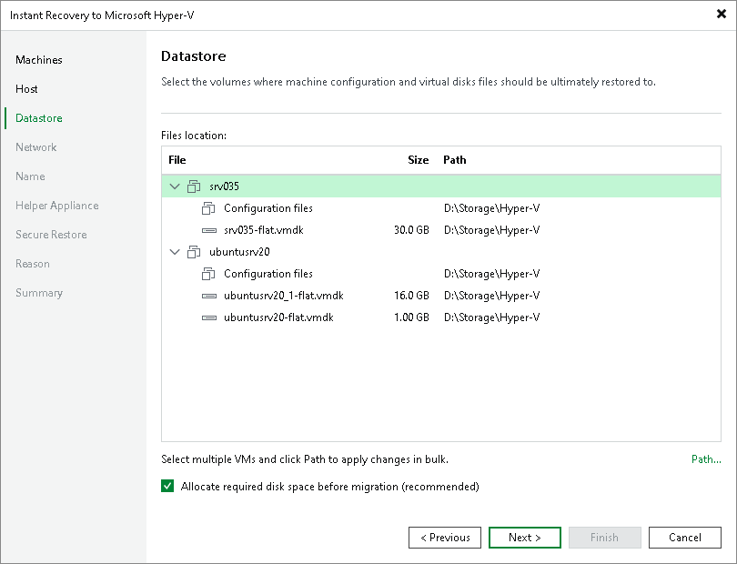

# Step 6. Select Target Datastores

In this article

This step is available if you recover workloads to a new location or with different settings.

At the Datastore step of the wizard, specify a path to the folder where VM configuration files and disks will be stored:

1. In the Files location list, select the workloads that will be recovered to the same host and click Path. Alternatively, you can expand a workload in the list and select individual files. Use this method if you want to place configuration and disk files to different locations.
2. In the Select Folder window, do one of the following:

* Select an existing folder where VM files will be stored.
* Create a new folder by clicking New Folder at the bottom of the window.
* Type a path to an SMB3 shared folder in the search field at the bottom of the Select Folder window. The path must be specified in the UNC format, for example: \\172.16.11.38\Share01.

|  |
| --- |
| Important |
| The host or cluster on which you register VMs must have access to the specified SMB3 shared folder. If you are using SCVMM 2012 or later, the server hosting the Microsoft SMB3 shared folder must be registered in SCVMM as a storage device. For more information, see [Microsoft Docs](https://docs.microsoft.com/en-us/previous-versions/system-center/system-center-2012-R2/jj614620%28v%3Dsc.12%29). |

1. Check that the Allocate required disk space before migration check box is selected if you want to preallocate disk space required for the recovered VM. Otherwise, clear the check box.

Page updated 8/8/2025

Page content applies to build 13.0.1.1071
