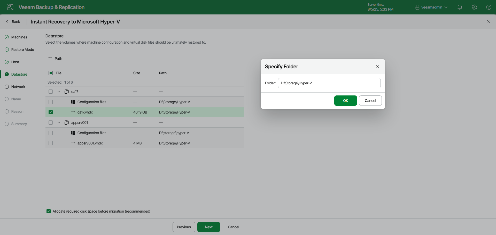

# Step 5. Select Target Datastores

In this article

The Datastore step of the wizard is available if you have selected Restore to a new location or with different settings at the [Restore Mode](ir_mode_hv_web.md) step.

At the Datastore step of the wizard, specify a path to the folder where VM configuration files and disks will be stored:

1. Select the necessary files in the list and click Path.
2. In the Specify Folder window, specify an existing folder, a new folder or a path to an SMB3 shared folder where VM files will be stored. The SMB share path must be specified in the UNC format, for example: \\172.16.11.38\Share01.

|  |
| --- |
| Important |
| The host or cluster on which you register VMs must have access to the specified SMB3 shared folder. The server hosting the Microsoft SMB3 shared folder must be registered in SCVMM as a storage device. For more information, see [Microsoft Docs](https://docs.microsoft.com/en-us/previous-versions/system-center/system-center-2012-R2/jj614620%28v%3Dsc.12%29). |

1. Click OK.
2. Check that the Allocate required disk space before migration check box is selected if you want to preallocate disk space required for the recovered VM. Otherwise, clear the check box.

Page updated 9/1/2025

Page content applies to build 13.0.1.1071
