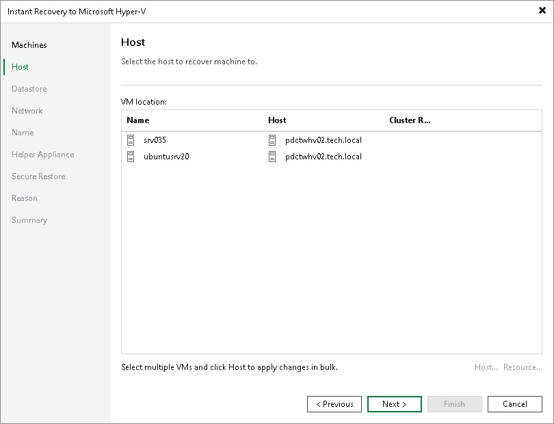

# Step 5. Select Target Hosts

In this article

This step is available if you recover workloads to a new location or with different settings.

At the Host step of the wizard, specify a target Hyper-V host or a Hyper-V cluster where you want to locate the recovered VMs:

1. In the VM location list, select the necessary VMs and click Host.
2. In the Select Server window, select a standalone host or cluster where the selected VM will be registered.
3. If you have selected a Hyper-V cluster, you can specify the cluster resource settings. Click Resource and select one of the following options in the Cluster Resource Settings window:

* Register VM as a cluster resource — if you want to assign a cluster role to the recovered VM.
* Do not register VM as a cluster resource — if you do not want to assign a cluster role to the recovered VM.

Page updated 8/8/2025

Page content applies to build 13.0.1.1071
