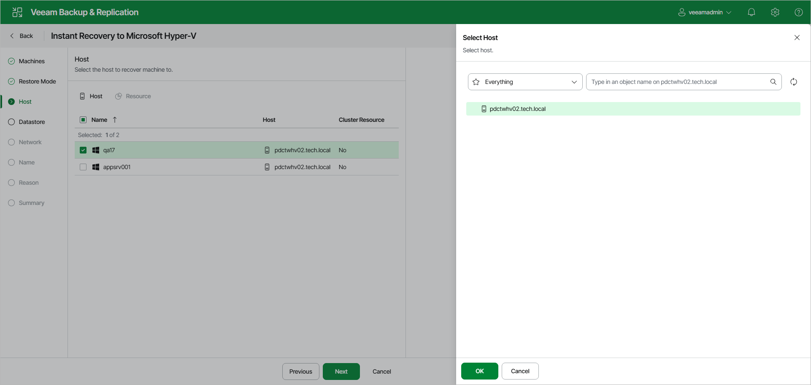

# Step 4. Select Target Hosts

The Host step of the wizard is available if you have selected Restore to a new location or with different settings at the [Restore Mode](ir_mode_hv_web.md) step.

At the Host step of the wizard, specify a target Hyper-V host or a Hyper-V cluster node where you want to locate the recovered VMs:

1. In the list, select the necessary workloads and click Host.
2. In the Select Host window, select a standalone host or cluster node where the recovered VMs will be registered. Click OK.
3. If you have selected a Hyper-V cluster node, you can specify the cluster resource settings. Click Resource and select one of the following options in the Cluster Resource Settings window:

* Register VM as a cluster resource — if you want to assign a cluster node role to the recovered VMs.
* Do not register VM as a cluster resource — if you do not want to assign a cluster node role to the recovered VMs.

