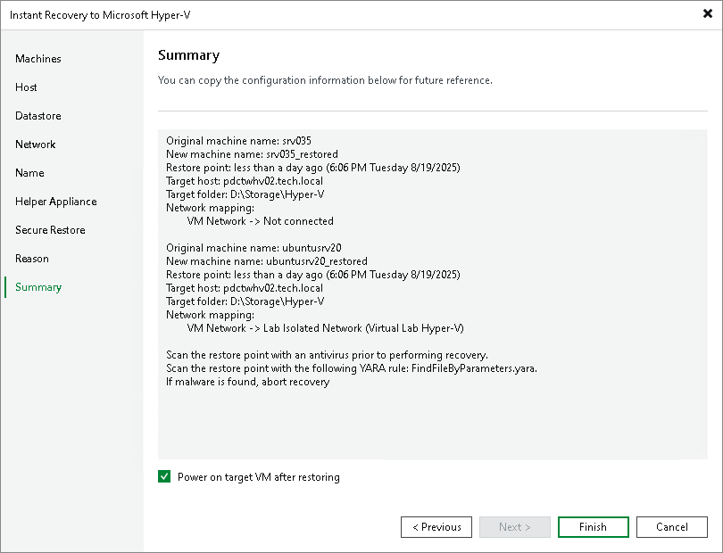

# Step 12. Verify Instant Recovery Settings

In this article

At the Summary step of the wizard, check settings of Instant Recovery and click Finish. If you want to start the recovered VMs on the target host, select the Power on target VM after restoring check box.

What You Do Next

[Finalizing Instant Recovery to Microsoft Hyper-V](ir_finalize_hv.md)

Page updated 8/5/2025

Page content applies to build 13.0.1.1071
