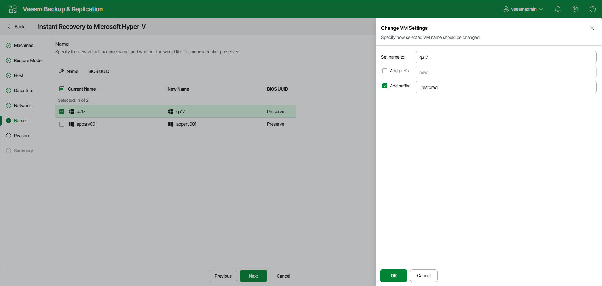

# Step 7. Change Names and UUIDs

In this article

The Name step of the wizard is available if you have selected Restore to a new location or with different settings at the [Restore Mode](ir_mode_hv_web.md) step.

To configure recovered VM settings:

1. To specify new names, select the necessary workloads in the list and click Name. In the Change VM Settings window, enter a name for recovered VMs explicitly or specify a change name rule by adding a prefix or suffix to the original name. Click OK.
2. To configure BIOS UUID, select the necessary workloads in the list and click BIOS UUID. In the BIOS UUID Settings window, choose if you want to generate a new UUID or preserve the existing one. Click OK.

Page updated 8/29/2025

Page content applies to build 13.0.1.1071
