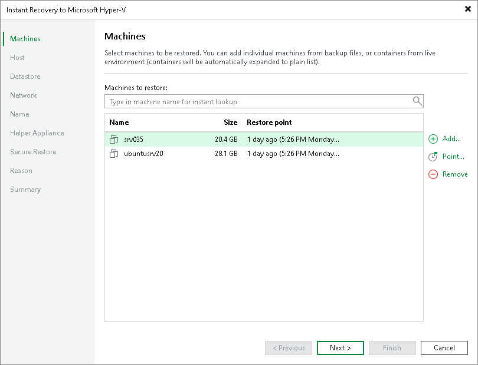

# Step 2. Select Workloads

At the Machines step of the wizard, select workloads that you want to recover:

1. Click Add.
2. In the Backup Browser window, do the following:

1. [For Hyper-V,VMware vSphere and VMware Cloud Director VMs] You can browse for necessary VMs using one of the following way:

* From infrastructure — use this option to browse the virtual environment and select VMs or VM containers to recover. If you choose a VM container, Veeam Backup & Replication will expand it to a plain VM list.
* From backup — browse existing backups and select VMs under backup jobs.

1. [For other workloads] In the list of backup jobs, expand a job and select workloads.
2. Click Add.

