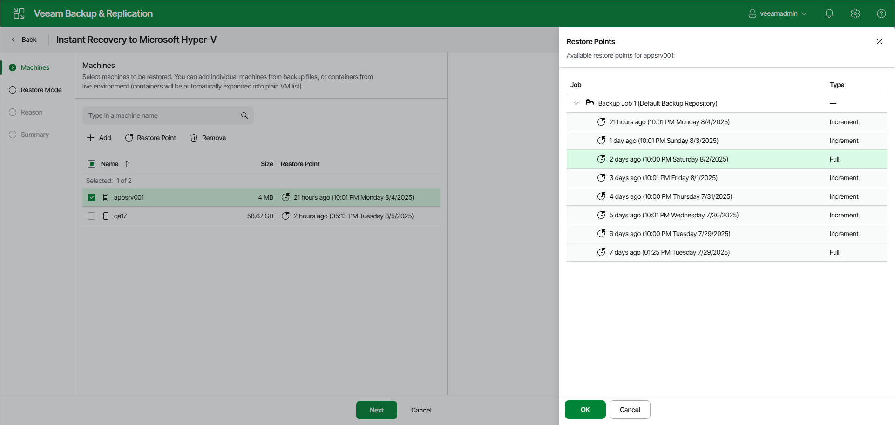

# Step 2. Select Workloads and Restore Points

At the Machines step of the wizard, you can change the list of workloads that you want to recover and also select restore points.

Selecting Workloads

You can add or delete workloads from the recovery list:

* To add workloads, click Add and select the workloads that you want to add from the opened list. To save the changes, click Add.

* To delete workloads, select the necessary workloads and click Remove.

Selecting Restore Points

To select a restore point:

1. Select the workloads for which you want to change the restore point.
2. Click Restore Point.
3. In the Restore Points window, choose the necessary restore point.
4. To save the changes, click OK.

