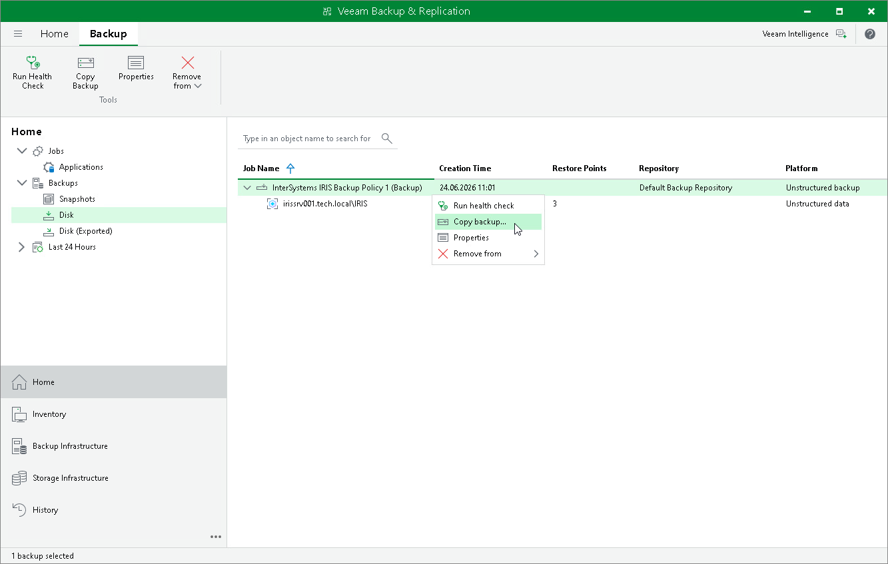

# Copying Backup

To create a backup copy, do one of the following:

* In the Disk node, select the InterSystems IRIS application backup policy and click Copy Backup on the ribbon.
* In the Disk node, right-click the InterSystems IRIS application backup policy and select the Copy backup option.

Veeam Backup & Replication will prompt you to specify a target backup repository where to place the backup copy files. Choose the target destination from the Backup repository list.

Page updated 2026-07-10

