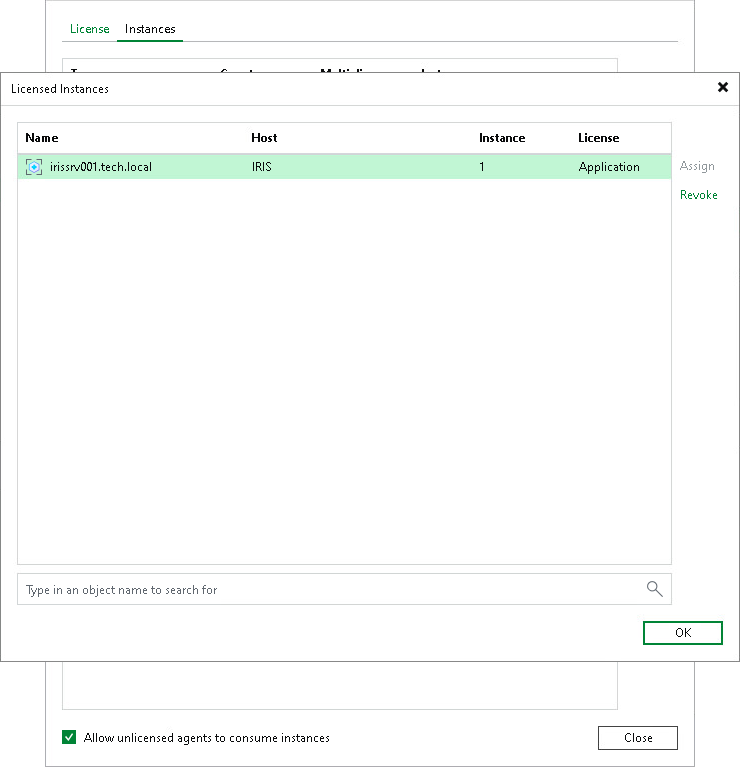

# Managing License

You can assign and revoke licenses for specific installed InterSystems IRIS instances from the Veeam Backup & Replication server. This process helps you manage license usage and ensure only intended installed instances consume licenses.

Assigning License Use

To assign license usage to individual instances, do the following:

1. From the main menu, select License.
2. In the License Information window, click the Instances tab and click Manage.
3. In the Licensed Instances tab, select the installed instance and click Assign.
4. Click Close.

Restricting License Use

You can also restrict license consumption only for a specific installed InterSystems IRIS instance.

To restrict license consumption for specific installed instances, do the following:

1. From the main menu, select License.
2. In the License Information window, click the Instances tab and click Manage.
3. In the Licensed Instances tab, select the installed instance and click Revoke.
4. Click OK and then click Close to close the windows.

Page updated 2026-08-05

