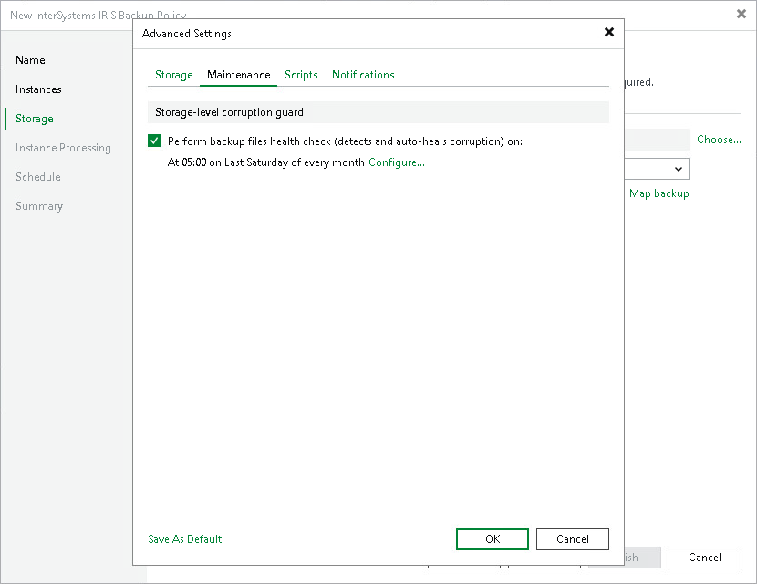

# Maintenance

To specify the application backup maintenance settings:

1. In the Advanced job settings window, click the Maintenance tab.
2. To periodically perform a health check for the latest restore point in the backup chain, in the Storage-level corruption guard section, select the Perform backup files health check check box and click Configure to specify the time schedule for the health check.

An automatic health check can help you avoid a situation where a restore point gets corrupted, making all dependent restore points corrupted, too. If during the health check Veeam Backup & Replication detects corrupted data blocks in the latest restore point in the backup chain (or the restore point before the latest one if the latest restore point is incomplete), it will start the health check retry and transport valid data blocks from the protected computer to the Veeam backup repository. The transported data blocks are stored to a new backup file or the latest backup file in the backup chain, depending on the data corruption scenario. For object storage, Veeam Backup & Replication offers a special health check mechanism as default. For details, see [Health Check for Object Storage Repositories](health_check_os.md).

Page updated 2026-07-10

