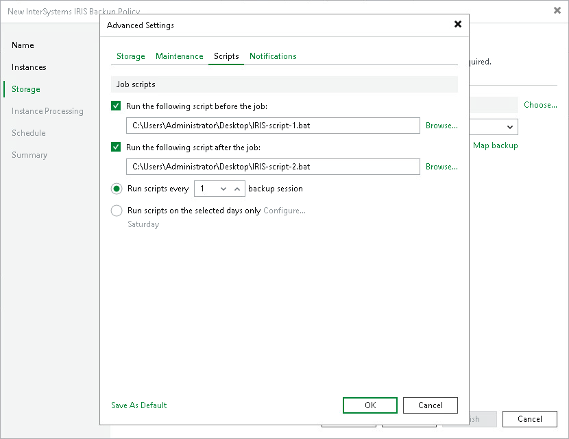

# Scripts

To specify pre-job and post-job script settings for the backup policy:

1. In the Advanced Settings window, click the Scripts tab.
2. Select the Run the following script before the job check box to run a script before the policy starts. Click Browse to select the script file.
3. Select the Run the following script after the job check box to run a script after the policy completes. Click Browse to select the script file.

Scripts must be executable files stored locally on the backup server. Veeam Backup & Replication will run the scripts on the backup server.

1. Select when the scripts must run. By default, Veeam Backup & Replication runs scripts during every policy session. To change this behavior, select either of the following options:

* Select the Run scripts every backup session option — Veeam Backup & Replication will run the scripts before and after every policy session.
* Select the Run scripts on selected days only option — Veeam Backup & Replication will run the scripts only on selected days of the week. Click Configure to choose the required days.
* If you select the Run scripts on selected days only option, Veeam Backup & Replication will run the scripts only once on each selected day, during the first policy session of that day. Subsequent sessions on the same day will not trigger the scripts.

|  |
| --- |
| NOTE |
| In snapshot-only mode, the policy creates storage snapshots only and does not transfer data to a backup repository. Pre-job and post-job scripts, if configured, still run before and after each policy session. For details about snapshot-only mode, see [Backup Types](iris_backup_types.md). |

Page updated 2026-07-10

