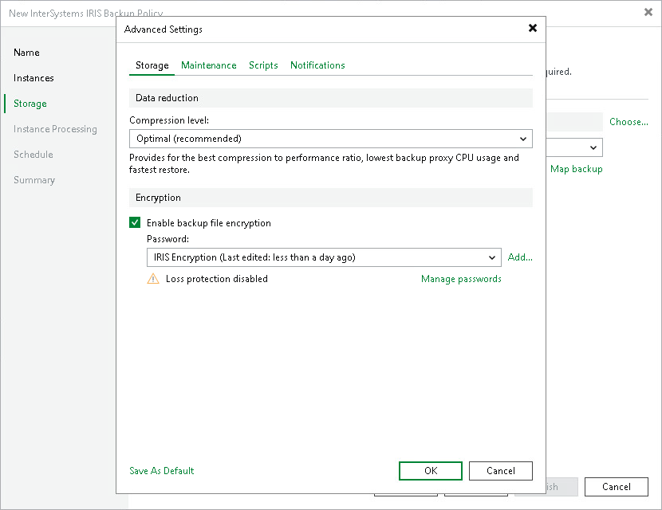

# Storage

To specify compression and encryption settings for the application backup policy:

1. In the Advanced job settings window, click the Storage tab.
2. From the Compression level list, select a compression level for the backup: None, Dedupe-friendly, Optimal, High or Extreme. For details on compression levels, see [Data Compression and Deduplication](compression_deduplication.md).
3. To encrypt the content of backup files, select the Enable backup file encryption check box. In the Password field, select a password that you want to use for encryption. If you have not created the password beforehand, click Add or use the Manage passwords link to specify a new password. For details, see [Password Manager](password_manager.md).

If the backup server is not connected to Veeam Backup Enterprise Manager, you will not be able to restore data from encrypted backups in case you lose the password. Veeam Backup & Replication will display a warning about it: Loss protection disabled. For details, see [Decrypting Backups With Enterprise Manager Keys](decrypt_without_pass.md).

Page updated 2026-07-10

