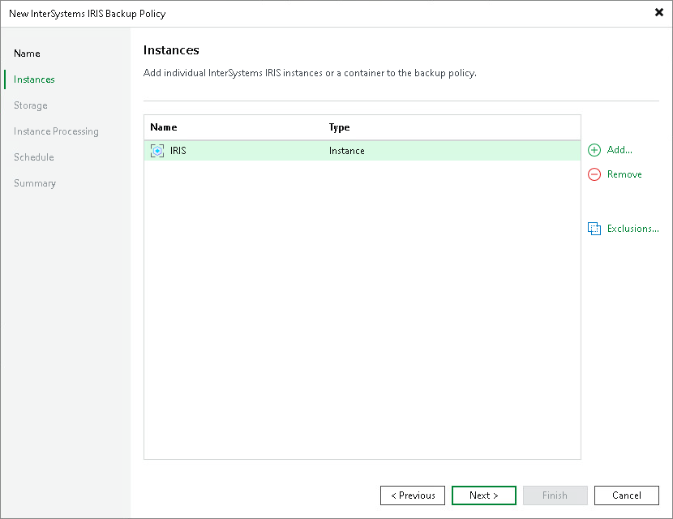

# Step 3. Specify Instances

On the Instances step of the wizard, click Add to add individual InterSystems IRIS instances or a protection group to the backup policy. Use the Exclusions link to specify instances that should be skipped within the selected scope.

Page updated 2026-07-29

