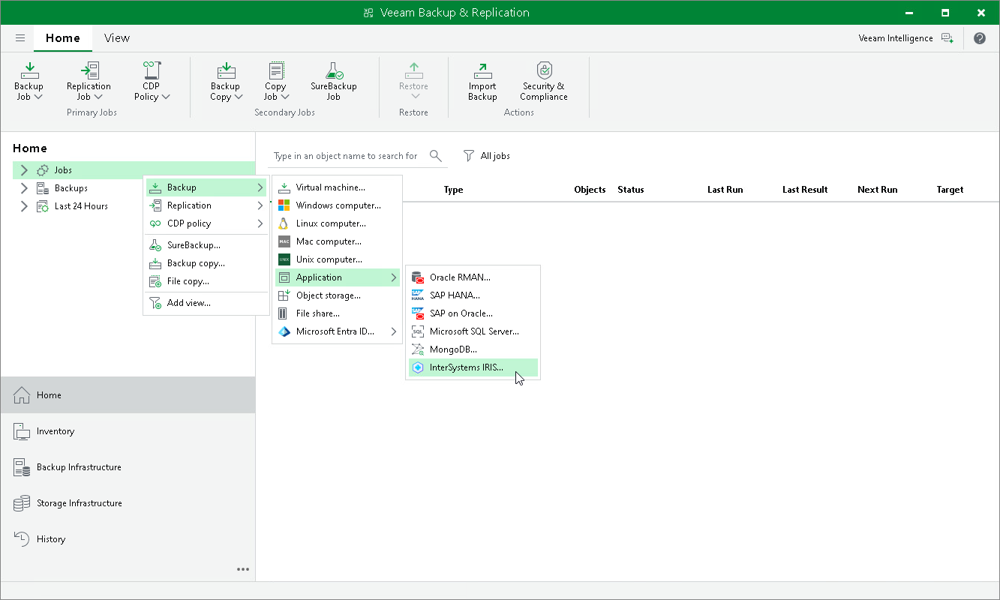

# Step 1. Launch New Application Backup Policy Wizard

To create an application backup policy for IRIS, you must launch the New Application Backup Policy wizard. To do this, on the Home tab, right-click Jobs > Backup > Application > InterSystems IRIS.

Page updated 2026-07-10

