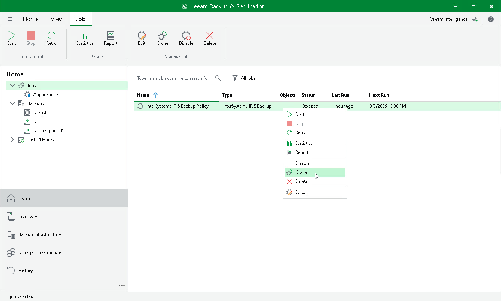

# Cloning Backup Policy

You can clone an application backup policy. For example, you may want to configure a policy to use as a template and then create multiple policies with similar settings.

To clone a backup policy:

1. Open the Home view.
2. In the inventory pane, select Jobs.
3. In the working area, select the backup policy and click Clone on the ribbon or right-click the policy and select Clone.
4. After the policy is cloned, you can edit all its settings, including the policy name.

Page updated 2026-07-15

