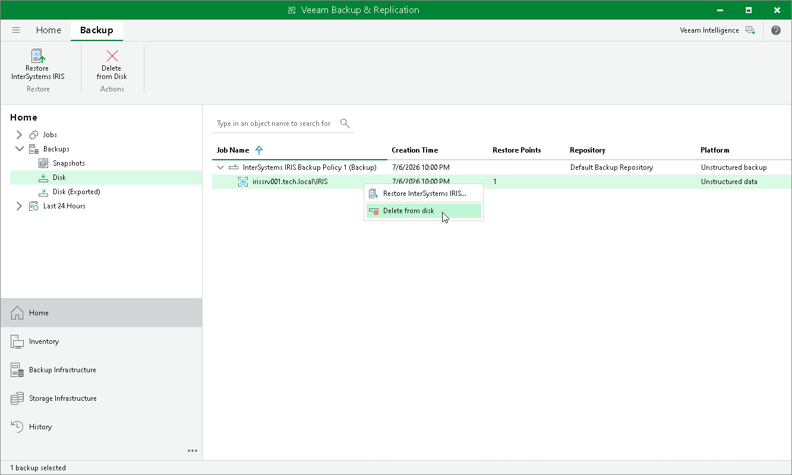

# Deleting Backup Policy

You can permanently remove a disabled application backup policy from Veeam Backup & Replication. Backups created by this policy remain in the target location.

To remove an application backup policy:

1. Open the Home view.
2. In the inventory pane, select Jobs.
3. In the working area, select the application backup policy and click Disable on the ribbon or right-click the policy and select Disable.
4. Wait for Veeam Backup & Replication to disable the policy, then select it and click Delete from Disk on the ribbon or right-click the policy and select Delete from disk.

After the policy is deleted, the backups created by it are displayed under the Backups > Disk (Orphaned) node.

Page updated 2026-07-28

