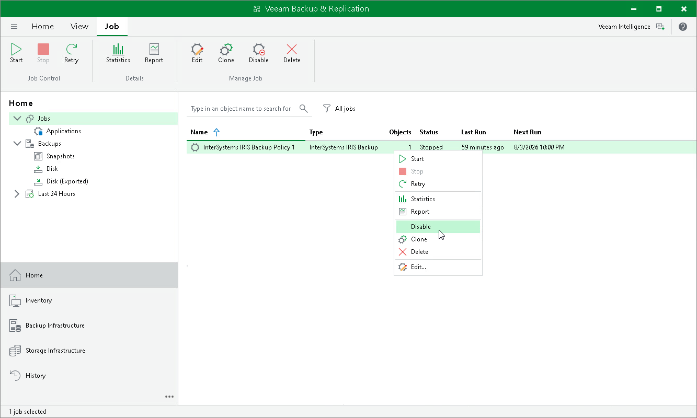

# Enabling and Disabling Backup Policy

You can temporarily disable a scheduled application backup policy. When you disable a policy, Veeam Backup & Replication does not start it by the specified schedule. You can start a disabled policy manually at any time, and you can enable it again whenever you need.

To disable an application backup policy:

1. Open the Home view.
2. In the inventory pane, select Jobs.
3. In the working area, select the application backup policy and click Disable on the ribbon or right-click the policy and select Disable.

To enable a disabled policy, select it in the list and click Disable on the ribbon once again.

Page updated 2026-07-15

