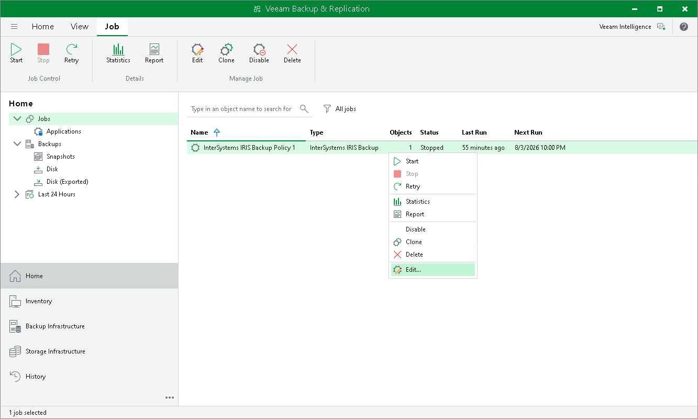

# Editing Backup Policy Settings

You can edit the settings of an application backup policy at any time. For example, you may want to change the backup scope, the target location or the scheduling settings.

To edit backup policy settings:

1. Open the Home view.
2. In the inventory pane, select Jobs.
3. In the working area, select the backup policy and click Edit on the ribbon or right-click the policy and select Edit.
4. Complete the steps of the Edit InterSystems IRIS backup policy wizard to change the policy settings as required.

Page updated 2026-07-15

