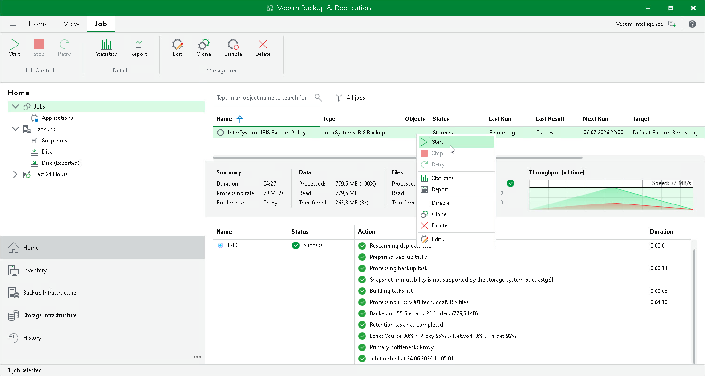
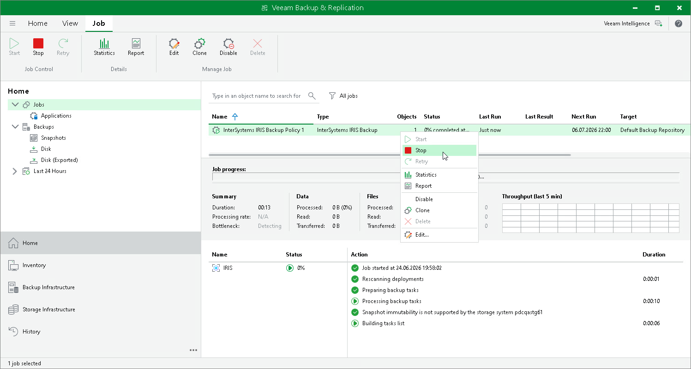

# Starting and Stopping Application Backup Policy

You can manually start an application backup policy. This may be helpful if you want to create an additional restore point and do not want to change the backup schedule. You can also stop the policy, for example, if processing of an instance is about to take long and you do not want to produce extra workload on the production environment during business hours.

Veeam Backup & Replication does not check whether the connection to the ODB servers is active at the time when the command is sent. The start or stop operation is performed only on those servers that received the command from the backup server.

Starting Application Backup Policy

To start an application backup policy:

1. Open the Home view.
2. In the inventory pane, select Jobs.
3. In the working area, select the backup policy and click Start on the ribbon or right-click the policy and select Start.

Stopping Application Backup Policy

To stop an application backup policy:

1. Open the Home view.
2. In the inventory pane, select Jobs.
3. In the working area, select the backup policy and click Disable on the ribbon or right-click the policy and select Disable. The application backup policy must be disabled before stopping.
4. In the working area, select the backup policy and click Stop on the ribbon or right-click the policy and select Stop. In the displayed window, click Yes.

Page updated 2026-06-24

