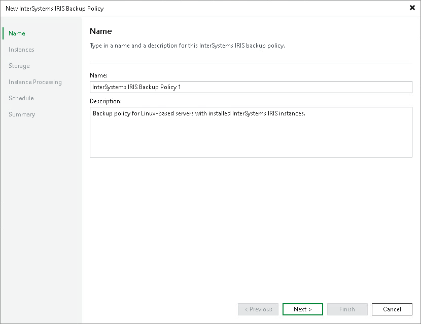

# Step 2. Specify Policy Name

At the Name step of the wizard, specify a name and description for the application backup policy.

1. In the Name field, enter a name for the application backup policy.
2. In the Description field, provide a description for future reference. The default description contains information about the user who created the policy, date and time when the policy was created.

Page updated 2026-07-10

