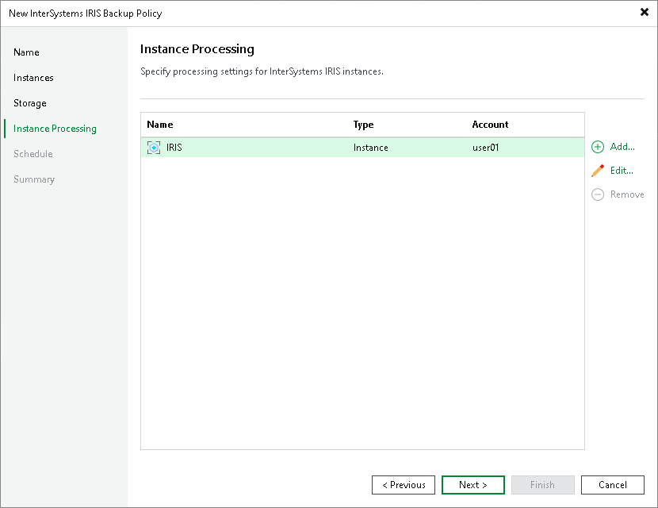

# Step 6. Specify Instance Processing Settings

At the Instance processing step of the wizard, specify the InterSystems IRIS instance owner user name that Veeam Backup & Replication uses to access each InterSystems IRIS instance for application-aware processing.

Veeam Backup & Replication connects to each instance through the Veeam Transport service already running on the ODB server and switches to the specified OS user to perform freeze and thaw operations. No password is required for this account. For details, see [Authentication](iris_auth_methods.md).

To manage per-instance accounts, use the following controls:

* Add — opens the account settings dialog for a new entry. Select the InterSystems IRIS instance from the list and specify the user name of the OS user that owns that instance.
* Edit — opens the account settings dialog for the selected entry. Change the user name as required.
* Remove — removes the selected per-instance account from the list.

|  |
| --- |
| NOTE |
| A user name must be provided for every InterSystems IRIS instance in the backup scope. If no per-instance account is specified for an instance, the backup policy session will fail with an OS authentication error. |

Page updated 2026-07-10

