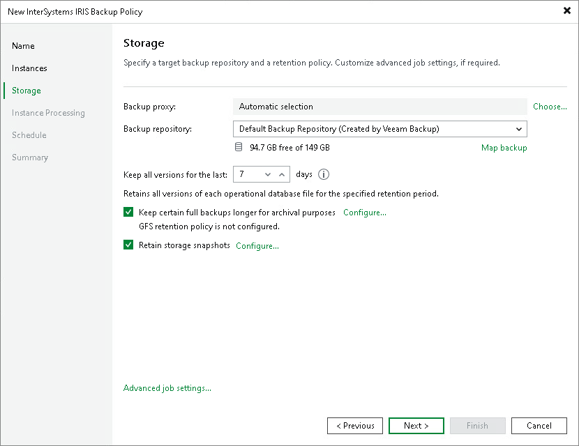

# Step 4. Specify Storage Settings

At the Storage step of the wizard, specify the backup proxy, the target backup location and the retention settings.

1. In the Backup proxy section, click Choose to select one or more Linux-based backup proxies for the policy. You can select Automatic selection to let Veeam Backup & Replication choose a suitable proxy, or Use the selected backup proxy servers only to specify a fixed list. Selecting multiple proxies can increase the processing rate when multiple instances are backed up simultaneously.
2. From the Backup repository list, select the target backup location for the policy.

To run the policy in snapshot-only mode, select the storage system from the list instead of a backup repository. The storage system appears as a storage-snapshot entry. In this mode, no data is transferred to a backup repository and the backup proxy is not used; Veeam Backup & Replication retains only storage snapshots on the storage system. The snapshots are kept for the number of days specified in the Retention policy setting below. Long-term (GFS) retention and the Retain storage snapshots option do not apply in snapshot-only mode.

1. You can map the policy to an existing backup stored on the selected backup repository. Backup mapping is useful if you have moved backup files to a new repository and want to point the policy to the existing backups, or if the configuration database was corrupted and you need to reconfigure the policy.

To map the policy to a backup, click the Map backup link and select the backup on the repository. Backups can be identified by policy name. You can also use the search field at the bottom of the window to locate the backup.

|  |
| --- |
| NOTE |
| You can map an InterSystems IRIS application backup policy only to backups created with another InterSystems IRIS application backup policy. You cannot map the policy to backups created with other types of backup policies or jobs. |

1. In the Retention Policy field, specify the number of days for which Veeam Backup & Replication keeps backup files in the target repository. By default, Veeam Backup & Replication keeps backup files for 7 days. After this period, Veeam Backup & Replication removes the earliest restore points from the backup chain. In snapshot-only mode, this setting instead specifies how long Veeam Backup & Replication keeps storage snapshots on the storage system.
2. To enable long-term retention, select the Keep certain full backups longer for archival purposes check box and click Configure. In the Configure GFS window, specify how weekly, monthly and yearly full backups must be retained. For details, see [Long-Term Retention Policy (GFS)](backup_copy_gfs.md).
3. In backup mode, to retain storage snapshots on the storage system in addition to backup files in the repository, select the Retain storage snapshots check box and click Configure. Specify the number of days to keep snapshots on the storage system, and optionally enable immutability to prevent snapshots from being modified or deleted during the specified period. For details, see [Storage Settings](iris_policy_advanced_storage.md).
4. Click Advanced job settings to configure additional options for the policy. To learn more, see [Specify Advanced Job Settings](iris_policy_advanced.md).

Page updated 2026-07-28

