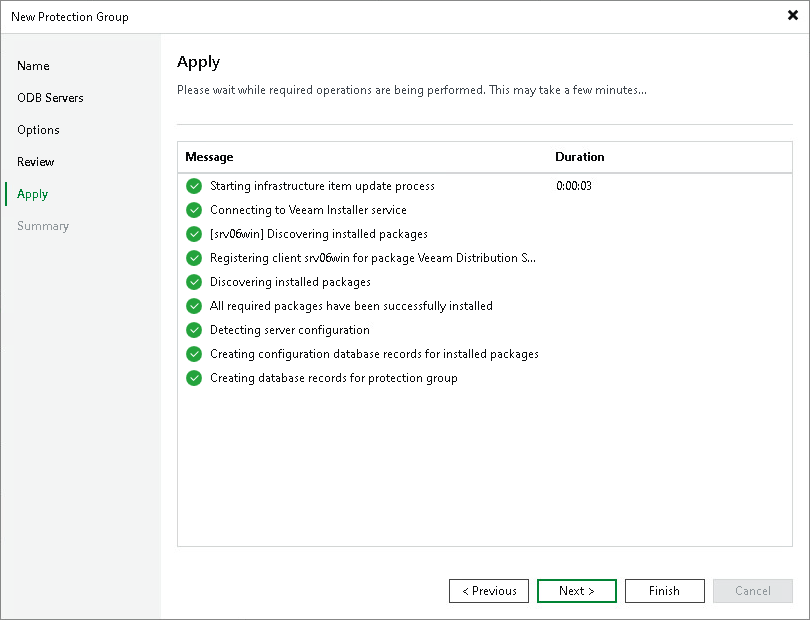

# Step 7. Assess Results

At the Apply step of the wizard, Veeam Backup & Replication runs the discovery job against each added ODB server and creates the configured protection group. Wait for the operation to complete and click Next to continue.

For details about the discovery job and the components it deploys, see [Computer Discovery and Veeam Components Deployment](iris_discovery_and_deployment.md).

Page updated 2026-07-10

