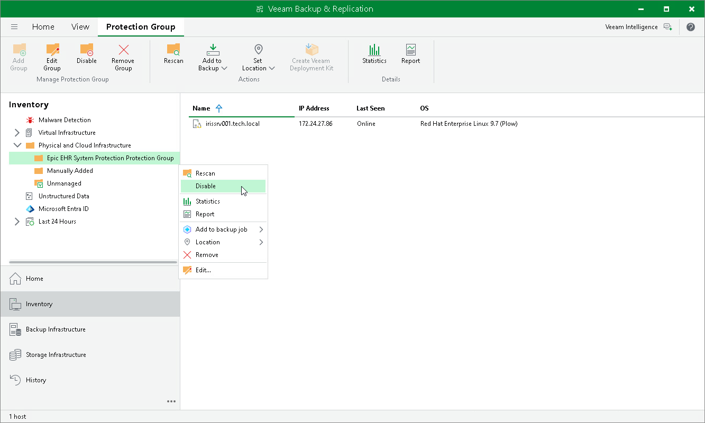

# Disabling Protection Group

You can temporarily disable a protection group. When you disable a protection group, you disable scheduled discovery of Epic EHR System Protection servers added to this protection group. This may be required, for example, if you want to make configuration changes to the Epic EHR System Protection servers without triggering automatic topology collection.

When you disable a protection group, Veeam Backup & Replication does not start the rescan job upon schedule defined in the protection group settings. However, you can start the discovery process manually. To learn more, see [Rescanning Protection Group](iris_protection_group_rescan.md).

Disabling a protection group does not affect processing of servers included in this protection group. If a server is added to an application backup policy and the policy is scheduled to start while the protection group is in the disabled state, the policy will run as usual.

|  |
| --- |
| NOTE |
| You cannot disable default protection groups that act as filters used to display protected computers of a specific type: Unmanaged, Out of Date, Offline and Untrusted. |

To disable automatic discovery for the protection group:

1. Open the Inventory view.

1. In the inventory pane, in the Physical and Cloud Infrastructure node, select the InterSystems IRIS protection group you want to disable and do one of the following:

* In the inventory pane, select the protection group that you want to add to the job and click Disable on the ribbon.
* In the working area, right-click the computer that you want to add to the job and select Disable.

1. In the inventory pane, select the necessary protection group and click Disable on the ribbon or right-click the necessary protection group and select Disable.

To enable automatic discovery for the protection group:

1. Open the Inventory view.

1. In the inventory pane, in the Physical and Cloud Infrastructure node, select the InterSystems IRIS protection group you want to enable and do one of the following:

* In the inventory pane, select the protection group that you want to add to the job and click Disable again on the ribbon.
* In the working area, right-click the computer that you want to add to the job and select Disable to clear the check mark.

Page updated 2026-07-24

