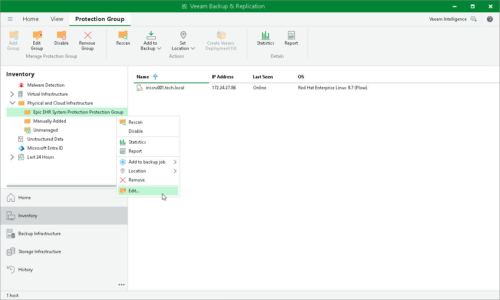

# Editing Protection Group Settings

You can edit the settings of a protection group. This may be required, for example, if you added a new InterSystems IRIS ODB server and need to add it to the protection group.

To edit protection group settings:

1. Open the Inventory view.
2. In the inventory pane, in the Physical and Cloud Infrastructure node, select the InterSystems IRIS protection group you want to edit and do one of the following:

* In the inventory pane, select the protection group that you want to add to the job and click Edit Group on the ribbon.
* In the working area, right-click the computer that you want to add to the job and select Edit.

1. Edit protection group settings as required.

Page updated 2026-07-10

