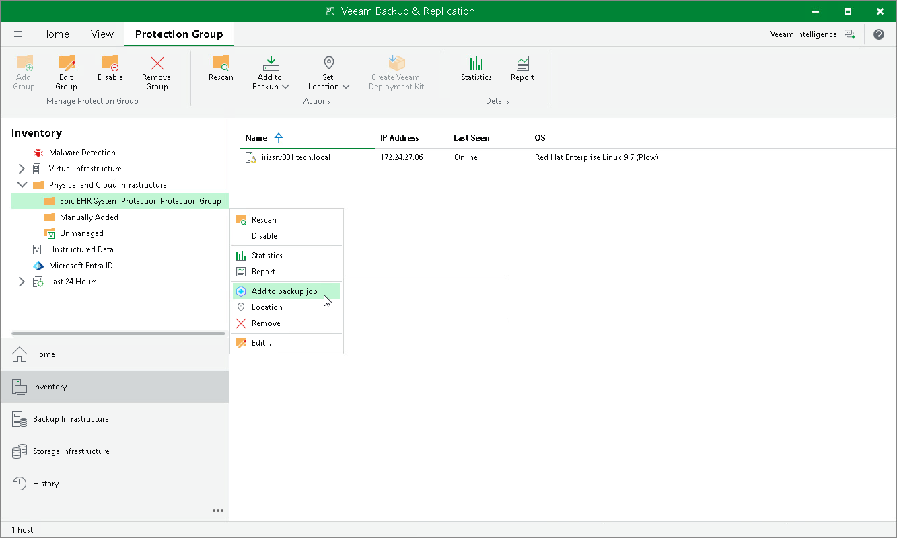

# Adding Protection Group to Application Backup Policy

To add a protection group to an application backup policy:

1. Open the Inventory view.
2. In the inventory pane, in the Physical and Cloud Infrastructure node, select the InterSystems IRIS protection group you want to add to an application backup policy and do one of the following:

* In the inventory pane, select the protection group that you want to add to the backup policy and click Add to Backup on the ribbon.
* In the working area, right-click the protection group that you want to add to the backup policy and select Add to backup job.

For more information on how to create an InterSystems IRIS protection group, see [Creating Application Backup Policy](iris_policy_create.md).

|  |
| --- |
| NOTE |
| You can also add a protection group when creating an application backup policy. To learn more, see [Creating Protection Group for InterSystems IRIS Instances](iris_protection_group_create.md). |

Page updated 2026-08-06

