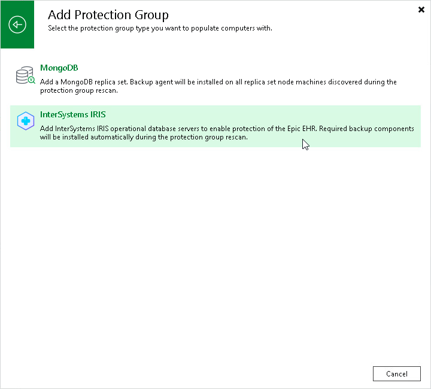

# Step 1. Launch New Protection Group Wizard

To launch the New Protection Group wizard, do the following:

1. Open the Inventory view.
2. Right-click the Physical Infrastructure node in the inventory pane and select Add protection group
3. In the Add Protection Group window, select Applications > InterSystems IRIS.

Page updated 2026-07-28

