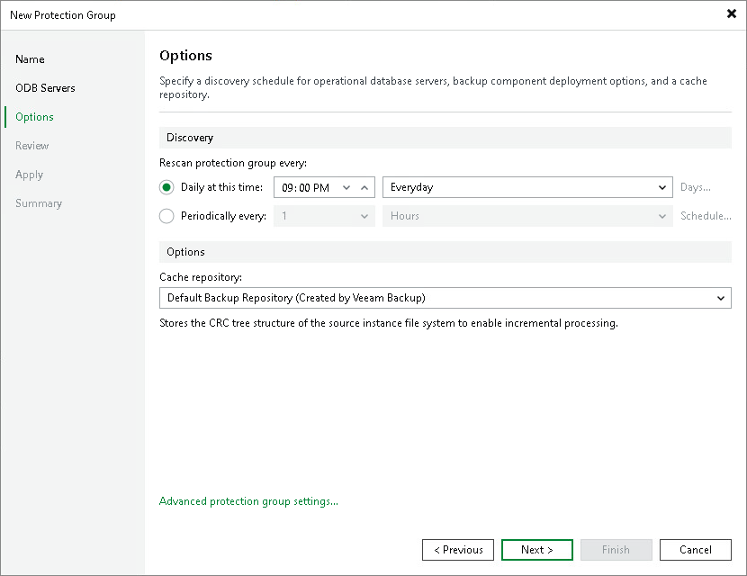

# Step 4. Specify Discovery and Processing Options

Veeam Backup & Replication regularly connects to ODB servers according to the schedule defined in the protection group settings. At this step of the wizard, you can define the discovery schedule and specify operations that Veeam Backup & Replication must perform on discovered ODB servers. You can also select which server in your backup infrastructure should act as a distribution server for Veeam components.

To specify discovery and deployment options:

1. In the Discovery section, define schedule for automatic ODB server discovery within the scope of the protection group:

* To run the rescan job at specific time daily, on defined week days or with specific periodicity, select Daily at this time. Use the fields on the right to configure the necessary schedule.
* To run the rescan job repeatedly throughout a day with a specific time interval, select Periodically every. In the field on the right, select the necessary time unit: Hours or Minutes. Click Schedule and use the time table to define the permitted time window for the rescan job. In the Start time within an hour field, specify the exact time when the job must start.

* To run the rescan job continuously, select the Periodically every option and choose Continuously from the list on the right. A new rescan job session will start as soon as the previous rescan job session finishes.

|  |
| --- |
| NOTE |
| You cannot create a protection group without defining schedule for automatic discovery. However, you can disable automatic discovery for a specific protection group, if needed. To learn more, see [Disabling Protection Group](iris_protection_group_disable.md). |

1. In the Options section, select the repository that stores the CRC tree structure of the source instance file system. The cache enables incremental processing during subsequent backup sessions.
2. Click Advanced protection group settings to specify the notification settings for the protection group. To learn more, see [Specify Advanced Protection Group Settings](iris_protection_group_advanced.md).

Page updated 2026-07-10

