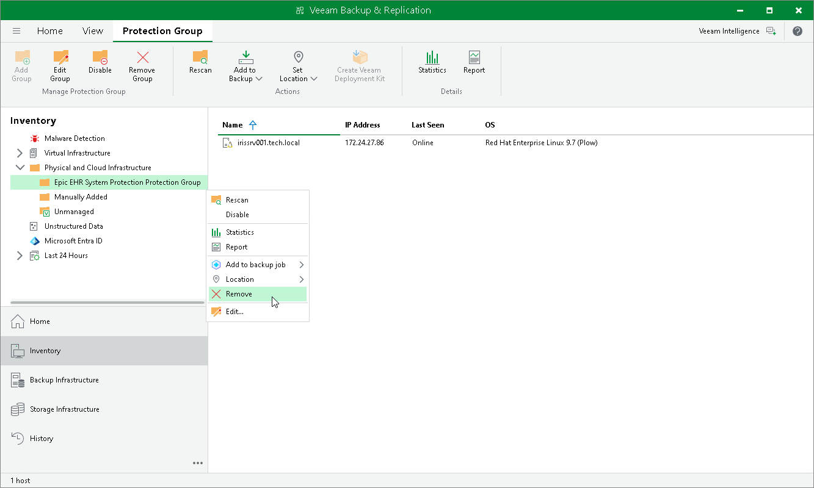

# Removing Protection Group

When you remove a protection group, you can instruct Veeam Backup & Replication to remove backup components from all servers included in this protection group. The protection group is removed permanently. You cannot undo this operation.

Backups created for servers that were included in the removed protection group remain intact in the backup location. You can delete this backup data manually later if needed.

|  |
| --- |
| NOTE |
| Consider the following:   * You cannot remove a protection group if it is added to an application backup policy. * You cannot remove default protection groups, such as Unmanaged, Out of Date and so on. |

To remove a protection group:

1. Open the Inventory view.
2. In the inventory pane, in the Physical and Cloud Infrastructure node, select the InterSystems IRIS protection group you want to remove and do one of the following:

* In the inventory pane, select the protection group that you want to add to the job and click Remove Group on the ribbon.
* In the working area, right-click the computer that you want to add to the job and select Remove.

1. If you want to remove backup components from the protected servers, in the displayed window, select the Uninstall Everything check box. With this option selected, Veeam Backup & Replication will remove the protection group from the configuration database and, in addition, uninstall the InterSystems IRIS plug-in and the Transport service from every server in the removed protection group.
2. In the displayed window, click Yes.

|  |
| --- |
| TIP |
| If you want to remove a certain server from the protection group, you must exclude it from the backup scope in the protection group settings. For details, see [Specify ODB Servers](iris_protection_group_odb_servers.md). |

Page updated 2026-07-29

