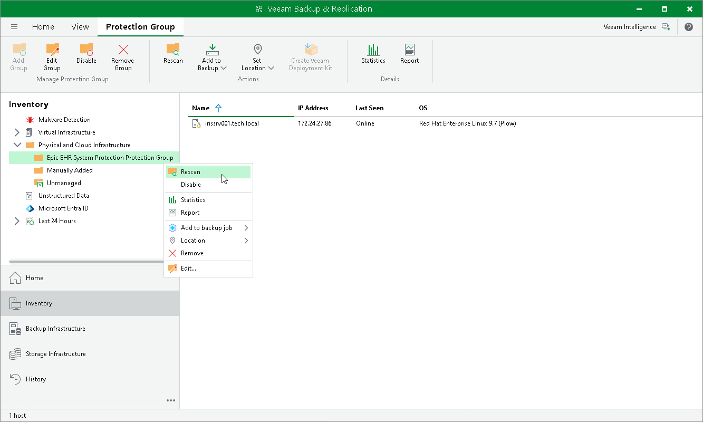

# Rescanning Protection Group

When you perform a protection group rescan, you manually start the discovery process for the protection group. This may be required, for example, if you added a new ODB server to the protection group and want to discover it without waiting for the next scheduled rescan.

During the rescan operation, Veeam Backup & Replication starts the rescan job in the same way as in case of scheduled discovery. The rescan job connects to servers included in the protection group, installs the required backup components, and collects the list of InterSystems IRIS instances and the storage volumes that host them. For details, see [Rescan Job](iris_rescan_job.md).

To rescan a protection group:

1. Open the Inventory view.
2. In the inventory pane, in the Physical and Cloud Infrastructure node, select the InterSystems IRIS protection group you want to rescan and do one of the following:

* Click Rescan on the ribbon.
* Right-click the protection group and select Rescan.

Page updated 2026-08-06

