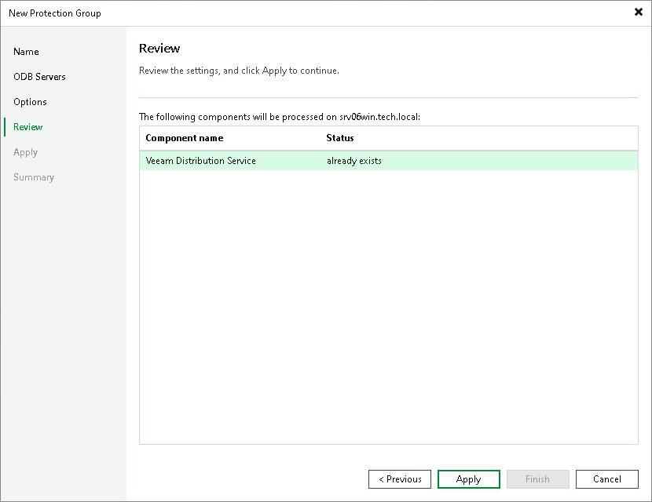

# Step 6. Review Components

At the Review step of the wizard, review what Veeam Backup & Replication components are already installed on the distribution server specified for the protection group and what components will be installed.

1. Review the components.
2. Click Apply to add the configured protection group to the inventory.

Page updated 2026-07-10

