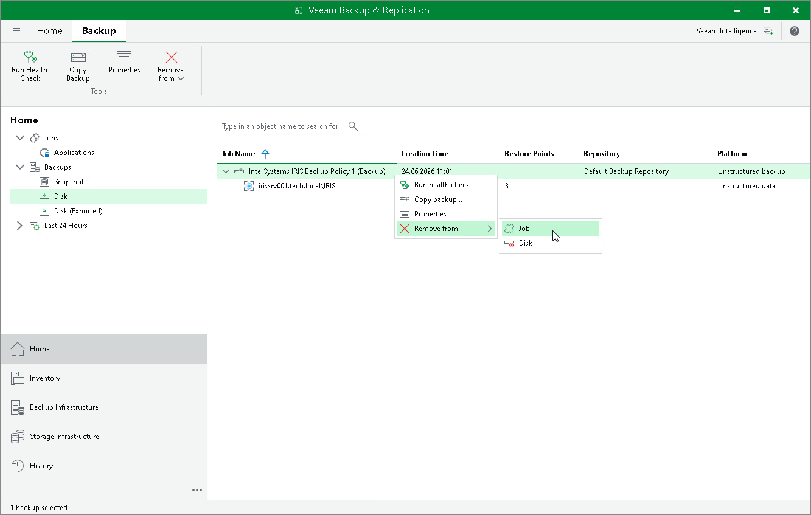

# Removing Backup from Backup Policy

If you want to remove records about application backups of InterSystems IRIS instances from the Veeam Backup & Replication console and configuration database, you can use the Remove from job operation. When you remove an application backup from a application backup job, the actual backup files remain on the backup repository. You can import the backup to the Veeam Backup & Replication at any time later and restore data from it.

You can remove specific backups related to individual computers in the backup.

|  |
| --- |
| NOTE |
| You can use the Veeam Backup & Replication console to remove backups created by application backup policies in the Veeam backup repository. Backups created on a local drive of a protected computer or in a network shared folder are not displayed in the Veeam backup console. |

To remove an application backup from configuration:

1. Open the Home view.
2. In the inventory pane, click Backups.
3. To remove a backup of a specific InterSystems IRIS instance, select the application backup policy, press and hold the [Ctrl] key, right-click the backup and select Remove from > Job.

Page updated 2026-07-29

