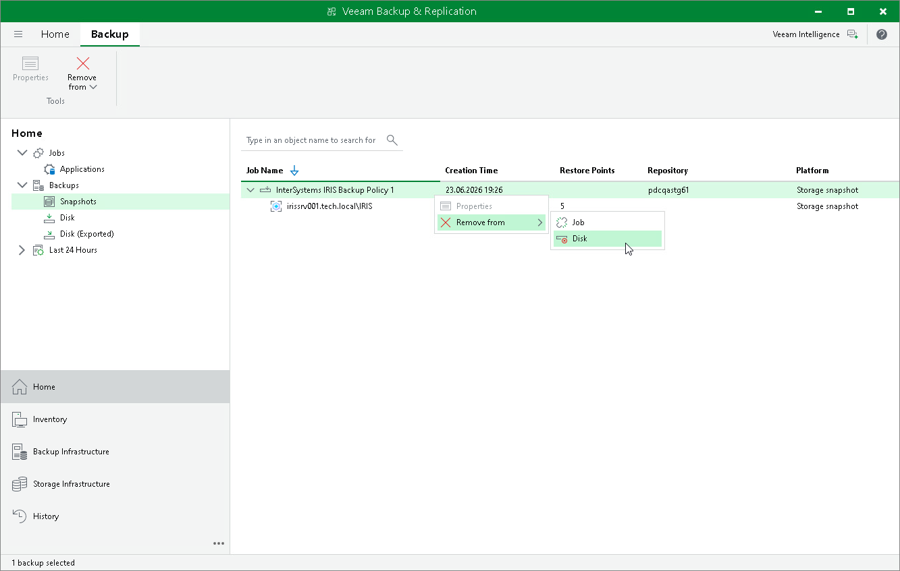

# Deleting Backup from Disk

If you want to permanently delete InterSystems IRIS instance storage snapshots from the storage system, you can use the Remove from Disk operation. Veeam Backup & Replication deletes the snapshots from the storage system through the Universal Storage API. This operation cannot be undone.

To delete a snapshot from disk:

1. Open the Home view.
2. In the inventory pane, click Backups.
3. In the working area, select the necessary snapshot and click Remove from > Disk on the ribbon, or right-click the snapshot and select Remove from > Disk.

Page updated 2026-07-10

