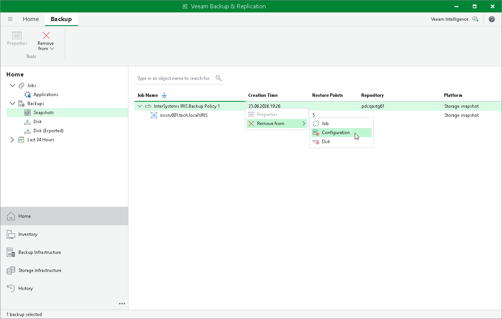

# Removing Backup from Configuration

If you want to remove records about InterSystems IRIS instance storage snapshots from the Veeam Backup & Replication console and configuration database without deleting the snapshots from the storage system, you can use the Remove from Configuration operation. The snapshots remain on the storage system and can be imported to Veeam Backup & Replication at any time. This operation is intended for experienced Veeam Backup & Replication users.

|  |
| --- |
| NOTE |
| You can use the Veeam Backup & Replication console to remove application backups stored in a Veeam backup repository. Backups stored on a local drive of a protected computer or in a network shared folder are not displayed in the Veeam Backup & Replication console. |

To remove a snapshot from configuration:

1. Open the Home view.
2. In the inventory pane, click Backups.
3. In the working area, expand the parent backup, select the necessary InterSystems IRIS instance snapshot, press and hold the [Ctrl] key, right-click the snapshot and select Remove from > Configuration.

Page updated 2026-07-10

