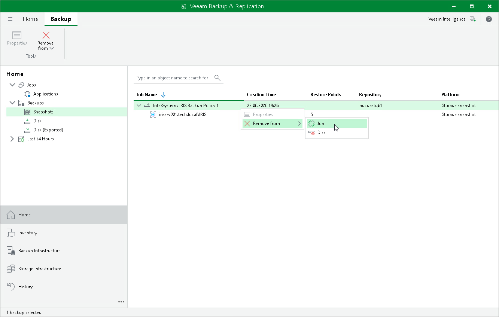

# Removing Backup from Backup Policy

If you want to detach InterSystems IRIS instance storage snapshots from the application backup policy without deleting them from the storage system, you can use the Remove from Job operation. When you remove a snapshot from the job, the snapshots remain on the storage system and continue to be visible in the Veeam Backup & Replication console under Backups > Disk (Orphaned). The next run of the application backup policy creates a new set of storage snapshots.

To remove a snapshot from the application backup policy:

1. Open the Home view.
2. In the inventory pane, click Backups.
3. In the working area, select the necessary snapshot and click Remove from > Job on the ribbon, or right-click the snapshot and select Remove from > Job.

Page updated 2026-07-29

