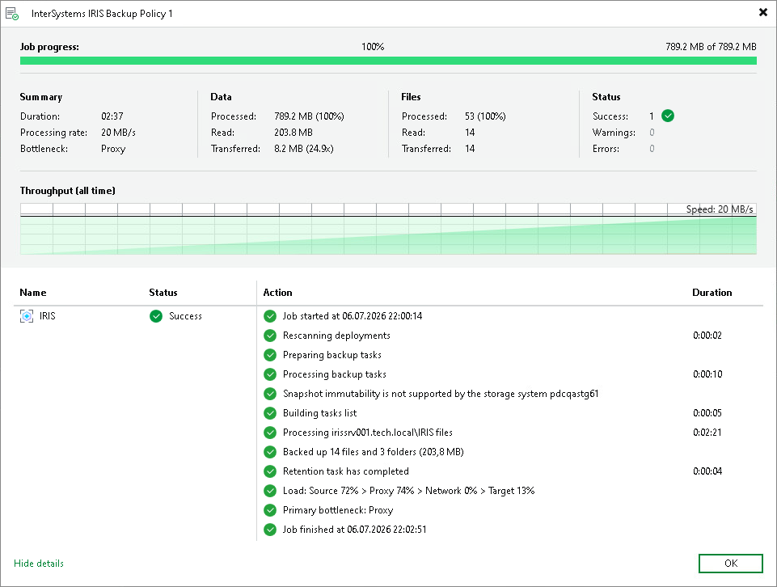

# Viewing Backup Policy Statistics

You can view statistics about application backup policies configured in Veeam Backup & Replication. Veeam Backup & Replication displays statistics in the following way:

After the application backup policy session statistics becomes available in Veeam Backup & Replication, this statistics appears in the policy statistics window. The policy session statistics becomes available in Veeam Backup & Replication on real-time basis.

|  |
| --- |
| TIP |
| In addition to backup policy statistics, Veeam Backup & Replication displays log backup statistics for each replica in the backup policy. You can view these statistics in the Last 24 Hours node of the Home view and in the History view of the Veeam backup console. |

To view application backup policy statistics:

1. Open the Home view.
2. In the inventory pane, click the Jobs node.
3. In the working area, double-click the Epic EHR System Protection application backup policy. Alternatively, you can select the necessary application backup policy and click Statistics on the ribbon or right-click the backup policy and select Statistics.

Page updated 2026-07-24

