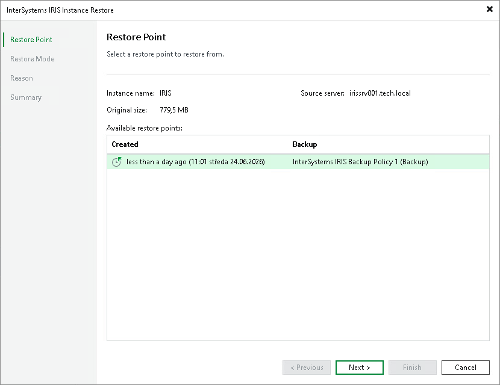

# Step 2. Select Restore Point

At the Restore Point step of the wizard, select a restore point from which you want to recover data.

By default, Veeam Backup & Replication selects the latest restore point. If you want to select another restore point, select any valid restore point from the Available restore points list to recover data.

Page updated 2026-07-28

