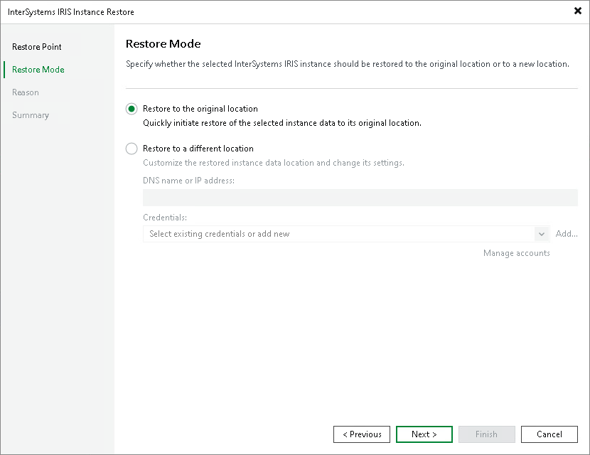

# Step 3. Choose Restore Mode

At the Restore Mode step of the wizard, specify where to restore the InterSystems IRIS instance data. Select the Restore to original location option to restore the data to the same ODB server from which the backup was created and write it to the same file system paths.

|  |
| --- |
| NOTE |
| Veeam Backup & Replication assumes that the file system paths on the target ODB server are identical to the paths recorded in the backup. If the paths have changed since the backup was created, select Restore to a different location and use path mapping to correct the discrepancy. For details, see [Restoring to Different Location](iris_restore_different_location.md). |

Page updated 2026-06-25

