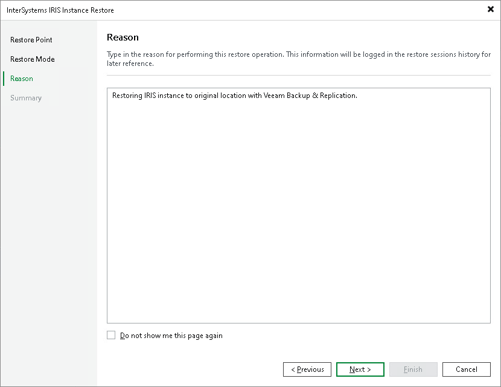

# Step 4. Specify Restore Reason

At the Reason step of the wizard, enter a reason for restoring the instance.

|  |
| --- |
| Tip |
| If you do not want to display the Reason step of the wizard in future, select the Do not show me this page again check box. |

Page updated 2026-06-25

