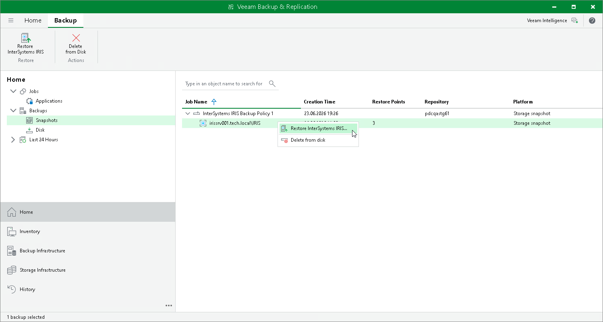

# Step 1. Launch InterSystems IRIS Instance Restore Wizard

To launch database from an application backup:

1. Open the Home view.
2. In the inventory pane, click Backups > Disk > Snapshots.
3. In the working area, select the backed up InterSystems IRIS instance and select Restore InterSystems IRIS on the ribbon or right-click the backup and select Restore InterSystems IRIS.

Page updated 2026-07-10

