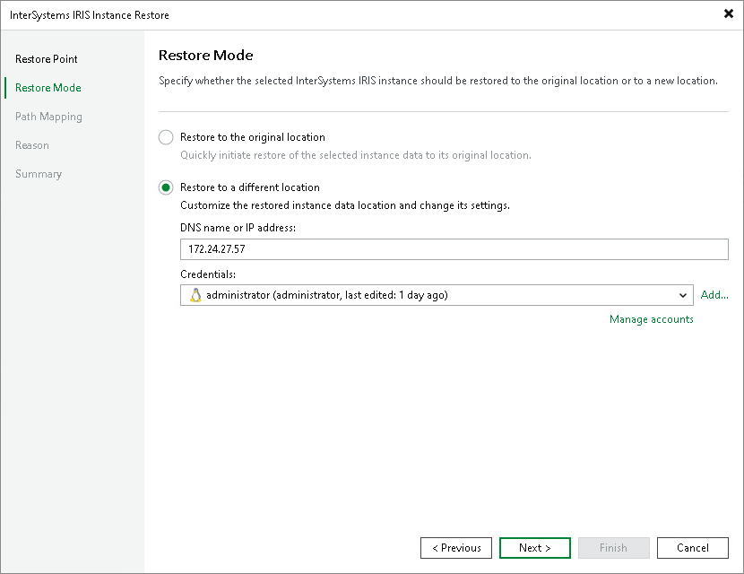

# Step 3. Choose Restore Mode

At the Restore Mode step of the wizard, specify where to restore the InterSystems IRIS instance data.

1. Select the Restore to a different location option to restore the data to a different ODB server or to a different file system path.
2. Specify the target server connection parameters and credentials. In this case, from the Credentials list, select a user account that has administrative permissions on the computer that you want to select as the location for restore InterSystems IRIS instance backup data.

If you have not set up credentials beforehand, click the Manage accounts link or click Add on the right to add credentials.

Veeam Backup & Replication allows you to add the following types of credentials:

* Stored credentials. Select stored credentials if you want Veeam Backup & Replication to use the specified user name and password for each connection to computer.

* Single-use credentials. Select single-use credentials if you do not want Veeam Backup & Replication to store credentials in the configuration database. With this option selected, Veeam Backup & Replication will use the specified user name and password only for the first connection to the computer. After that, Veeam Backup & Replication will use Veeam Transport Service to communicate with the computer.

Keep in mind that the username must be specified in the [down-level logon name](https://docs.microsoft.com/en-us/windows/win32/secauthn/user-name-formats#down-level-logon-name) format. For example, DOMAIN\UserName or HOSTNAME\UserName. Use the full domain or hostname name. Do not replace them with a dot.

For more information, see [Credentials Manager](credentials_manager.md).

Page updated 2026-06-25

