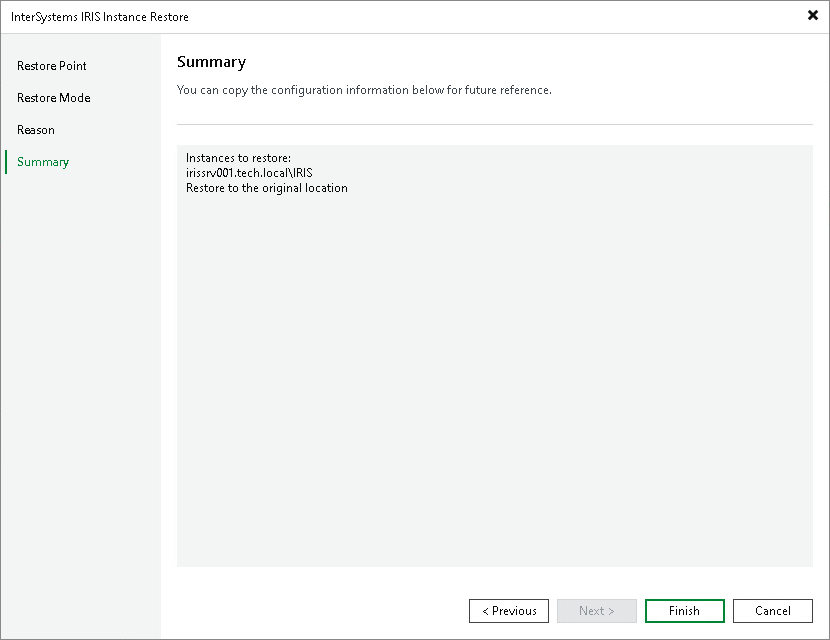

# Step 5. Complete Restore Process

At the Summary step of the wizard, review the restore settings.

1. Review settings of the restore process.
2. Click Finish to close the wizard.

Page updated 2026-06-25

