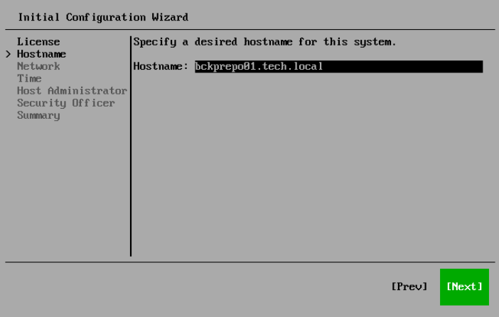

# Step 5. Specify Hostname

At the Hostname step of the Initial Configuration wizard, specify the name of the server and select Next.

|  |
| --- |
| Note |
| Consider the following:   * It is recommended that you use a Fully Qualified Domain Name as a hostname. * The Keyboard layout field shows the layout currently used in the wizard. If you use a keyboard with a layout other than US English, press [Ctrl+K], find and select the layout you want to use, and press [Enter]. |

You can change the server name later in the Host Management console. For more information, see [Changing Server Name](hmc_configure_hostname.md).

Page updated 2026-07-28

