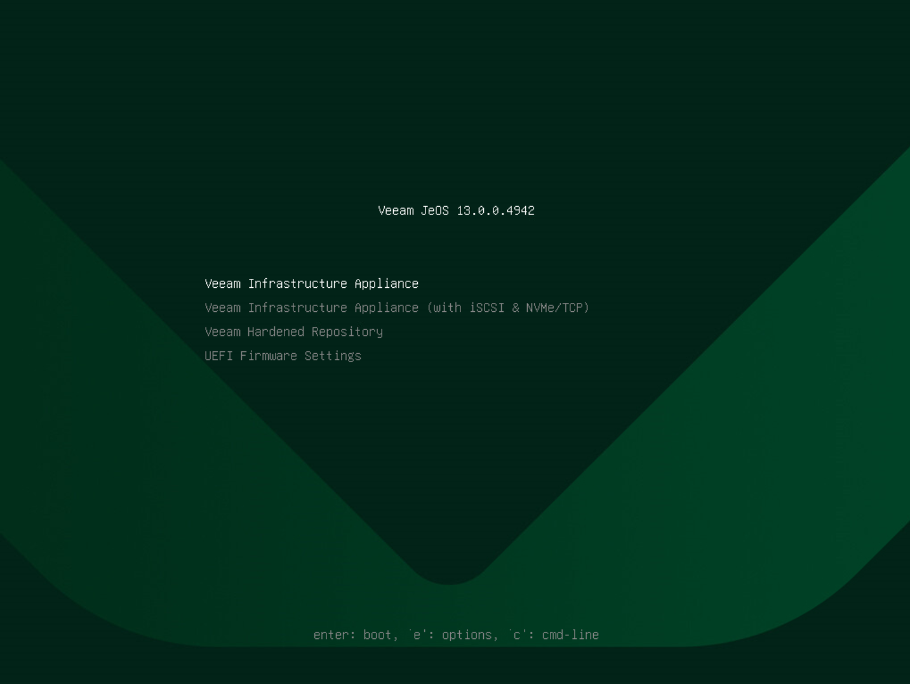

# Step 2. Select Product

In the installation menu, select one of the following:

* Veeam Infrastructure Appliance
* Veeam Infrastructure Appliance (with iSCSI & NVMe/TCP)

|  |
| --- |
| Note |
| You must select this option when you plan to deploy a VMware backup proxy for backup from storage snapshots using the iSCSI or NVMe/TCP protocol. For more information on proxies, see [VMware Backup Proxies](backup_proxy.md). |

* Veeam Hardened Repository

|  |
| --- |
| Note |
| Veeam Hardened Repositories have specific requirements and limitations. For more information, see [Requirements and Limitations](hardened_repository_limitations.md). |

Then, press [Enter].

