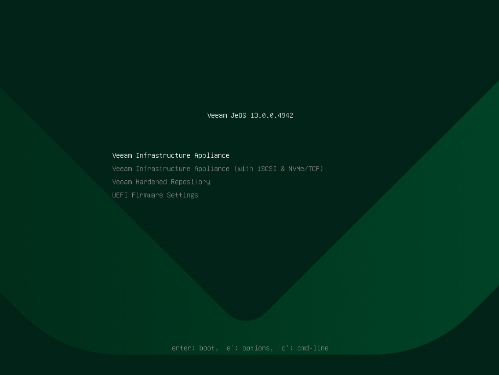

# Step 2. Select Product

In the installation menu, select one of the following deployment types and press [Enter]:

* Standard (Multi-Disk) Deployment — select this deployment type to deploy the appliance to multiple disks. This is the default option. The Veeam Infrastructure Appliance installer will use all available disks to create separate system and data volume groups.
* Single-Disk Deployment — select this deployment type to deploy the appliance to a single disk. For example, if you want to use the appliance as a backup proxy. If multiple disks are present, the Veeam Infrastructure Appliance installer will use the smallest disk.

|  |
| --- |
| Important |
| If you select Single-Disk Deployment, all local disks connected to the host are formatted during installation, even though only one disk is used for the appliance. |

Page updated 2026-07-28

