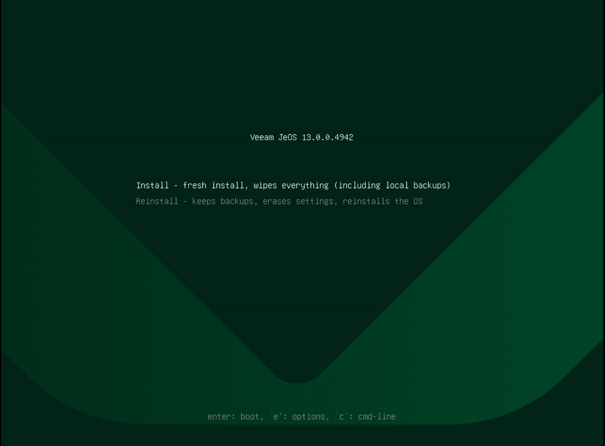

# Step 3. Begin Installation

In the deployment submenu, select Install and press [Enter].

|  |
| --- |
| Note |
| The submenu also contains the Reinstall and Upgrade Hardened Repository to the latest version options. For more information on reinstalling the appliance, see [Reinstalling Veeam Infrastructure Appliance with ISO](linux_infrastructure_appliance_reinstall.md). |

When the installer is loaded, confirm the operation.

After the installation is complete, do the following:

1. Select Reboot System or wait for the system to reboot automatically.
2. After the system reboots, complete the Initial Configuration wizard.

Page updated 2026-07-28

