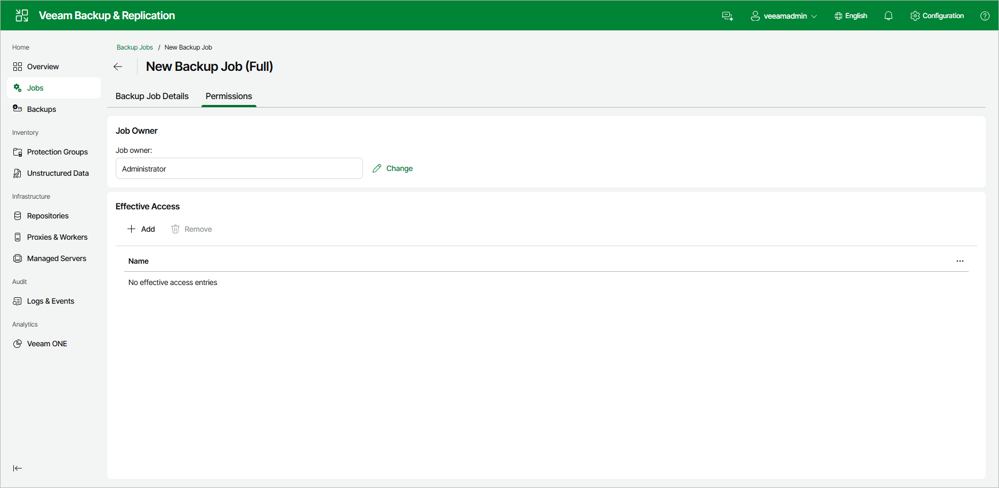

# Managing Backup Job Permissions

To manage who owns a backup job and who can access it, open the backup job details as described in section [Viewing Backup Job Details](realtime_statistics_web.md) and click the Permissions tab.

Job Owner

The Job owner box shows the user account that owns the job. By default, the job is owned by the account that created it. Only the current job owner or a Veeam Backup & Replication administrator can change the job owner or modify access entries.

To change the owner, do the following:

1. Click Change next to the Job owner field.
2. Select the account that will own the job. The owner must be an individual user account already added to Veeam Backup & Replication, as described in section [Configuring Users Using Web UI](configuring_users_web.md).

Effective Access

The Effective Access box lists the users and roles that have been granted access to the job and the level of access each one has. By default, no access is granted, and the box shows No effective access entries.

To grant access, do the following:

1. Click Add.
2. Select the user or group to add to the list.

To revoke access, select an entry in the list and click Remove.

Page updated 2026-06-19

